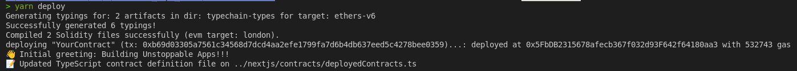
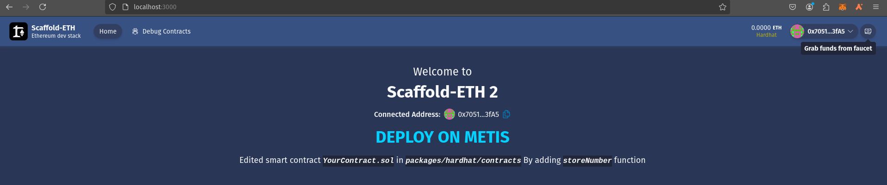
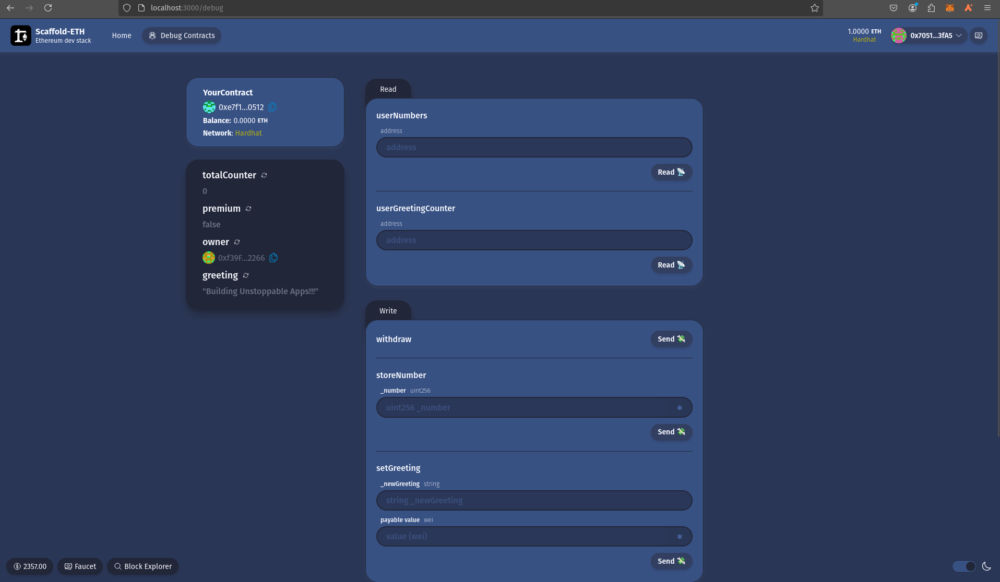
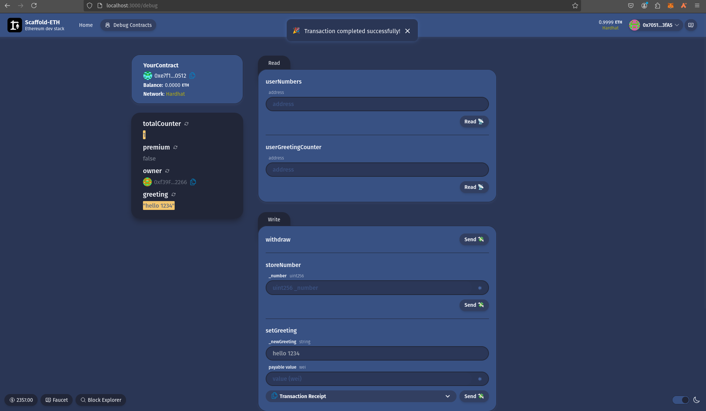
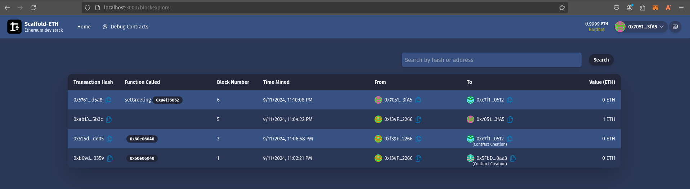
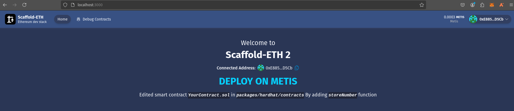

# BUILDH3R Sept Metis

- Clone Template Repo:
    ```sh
    git clone https://github.com/scaffold-eth/scaffold-eth-2.git
    cd scaffold-eth-2 && rm -rf .git
    ```

## Setup hardhat network for Local development:
### Install packages:
- Command:
    ```sh
    yarn install
    ```

### Start local Network:
- Do not close this tab. Command:
    ```sh
    yarn chain
    ```


### Deploy Contract:
- Command:
    ```sh
    yarn deploy
    ```

- Output:
    <details><summary> Detailed Output </summary><blockquote>

    ~~~
    > yarn deploy      
    Generating typings for: 2 artifacts in dir: typechain-types for target: ethers-v6
    Successfully generated 6 typings!
    Compiled 2 Solidity files successfully (evm target: london).
    deploying "YourContract" (tx: 0xb69d03305a7561c34568d7dcd4aa2efe1799fa7d6b4db637eed5c4278bee0359)...: deployed at 0x5FbDB2315678afecb367f032d93F642f64180aa3 with 532743 gas
    👋 Initial greeting: Building Unstoppable Apps!!!
    📝 Updated TypeScript contract definition file on ../nextjs/contracts/deployedContracts.ts
    ~~~

    </blockquote></details>

    

### Start Frontend:
- Command:
    ```sh
    yarn start
    ```
- We can verify our app is running in `http://localhost:3000`


### Modify Frontend:

- Edit `packages/nextjs/app/page.tsx` file:
    ```javascript
    </div>
        <p className="text-center text-lg mt-4">
        <strong style={{ fontSize: '36px', color: '#04D1fF'}}>DEPLOY ON METIS</strong>
        </p>
        {/* <p className="text-center text-lg">
        Get started by editing{" "}
        <code className="italic bg-base-300 text-base font-bold max-w-full break-words break-all inline-block">
            packages/nextjs/app/page.tsx
        </code>
        </p> */}
        <p className="text-center text-lg">
        Edited smart contract{" "}
        <code className="italic bg-base-300 text-base font-bold max-w-full break-words break-all inline-block">
            YourContract.sol
        </code>{" "}
        in{" "}
        <code className="italic bg-base-300 text-base font-bold max-w-full break-words break-all inline-block">
            packages/hardhat/contracts
        </code>{ " "}
        By adding <code className="italic bg-base-300 text-base font-bold max-w-full break-words break-all inline-block">storeNumber</code> function
        </p>
    </div>
    ```

### Modify Backend:
- Edit `packages/hardhat/contracts`:
    ```javascript
    /**
    * Function that allows the owner to withdraw all the Ether in the contract
    * The function can only be called by the owner of the contract as defined by the isOwner modifier
    */
    function withdraw() public isOwner {
        (bool success, ) = owner.call{ value: address(this).balance }("");
        require(success, "Failed to send Ether");
    }
    // Mapping from address to number
    mapping(address => uint) public userNumbers;
    event NumberUpdated(address indexed user, uint number);
    // Function to store a number
    function storeNumber(uint _number) public {
        userNumbers[msg.sender] = _number;
        emit NumberUpdated(msg.sender, _number);
    }
    ```


### Re-Deploy Contract:
- Make sure `yarn chain` is running in background tab:
    ```sh
    yarn deploy
    ```

    Output:
    <details><summary> Detailed Output </summary><blockquote>

    ~~~
    > yarn deploy      
    Generating typings for: 1 artifacts in dir: typechain-types for target: ethers-v6
    Successfully generated 6 typings!
    Compiled 1 Solidity file successfully (evm target: london).
    deploying "YourContract" (tx: 0x525d3acb1f9ec9bf469af96d5a9f238e4554a53f3b9bc9f380e5df9c71cfde05)...: deployed at 0xe7f1725E7734CE288F8367e1Bb143E90bb3F0512 with 574156 gas
    👋 Initial greeting: Building Unstoppable Apps!!!
    📝 Updated TypeScript contract definition file on ../nextjs/contracts/deployedContracts.ts
    ~~~
 
    </blockquote></details>


### Verify:
- Visit [http://localhost:3000](http://localhost:3000):
    

- Visit: [http://localhost:3000/debug](http://localhost:3000/debug):
    

- Create new Greet:

    

- Blockexplorer [http://localhost:3000/blockexplorer](http://localhost:3000/blockexplorer):\
    


## Deploy To Metis Sepolia Network:
### Generate Account:
- Command:
    ```sh
    yarn generate
    ```

    <details><summary> Detailed Output </summary><blockquote>

    ~~~
    > yarn generate
    👛 Generating new Wallet
    📄 Private Key saved to packages/hardhat/.env file
    🪄 Generated wallet address: 0xE885B5Ea505456F9E9Cae09324fA954A15fED5Cb
    ~~~

    </blockquote></details>


### Faucet Link:
- https://faucet-427702.uc.r.appspot.com/

### Add Metis Sepolia Config to `Hardhat.config.ts` file:
- Code Snippet:
    ```typescript
    andromeda : {
      url: "https://andromeda.metis.io/?owner=1888",
      accounts: [deployerPrivateKey],
      verify: {
        etherscan: {
          apiKey: "apikey is not required, just set a placeholder",
          apiUrl: "https://api.routescan.io/v2/network/mainnet/evm/1088/etherscan",
        },
      },
    },
    metisSepolia: {
      url: "https://sepolia.metisdevops.link/",
      accounts: [deployerPrivateKey],
        verify: {
          etherscan: {
            apiKey: "apikey is not required, just set a placeholder", 
            apiUrl: "https://sepolia.explorer.metisdevops.link",
          },
        },
    },
    ```

### Deploy contract to Metis Sepolia Network:
- Command:
    ```sh
    yarn deploy --network metisSepolia
    ```

    <details><summary> Detailed Output </summary><blockquote>

    ~~~
    > yarn deploy --network metisSepolia
    Nothing to compile
    No need to generate any newer typings.
    deploying "YourContract"
    (tx: 0x805247e595ad2be814cec225b496c5bb39eb854fbdd79d7cddb8d6749ebc09f6)...: deployed at 0x3e509aA24493BCaE5d48aAa7bb376B293F0d4B04 with 573976 gas
    👋 Initial greeting: Building Unstoppable Apps!!!
    📝 Updated TypeScript contract definition file on ../nextjs/contracts/deployedContracts.ts
    ~~~

    </blockquote></details>
    
    

- Here, 
    - Contract Address: `0x3e509aA24493BCaE5d48aAa7bb376B293F0d4B04`
    - Txn Hash: `0x805247e595ad2be814cec225b496c5bb39eb854fbdd79d7cddb8d6749ebc09f6`
    - Txn Link: [https://sepolia-explorer.metisdevops.link/tx/0x805247e595ad2be814cec225b496c5bb39eb854fbdd79d7cddb8d6749ebc09f6](https://sepolia-explorer.metisdevops.link/tx/0x805247e595ad2be814cec225b496c5bb39eb854fbdd79d7cddb8d6749ebc09f6)


### Deploy contract to Metis Andromeda  Network:
- Command:
    ```sh
    yarn deploy --network andromeda
    ```

    <details><summary> Detailed Output </summary><blockquote>

    ~~~
    > yarn deploy --network andromeda
    Nothing to compile
    No need to generate any newer typings.
    deploying "YourContract"
    (tx: 0xfdf0bfdc10e9f046919ca88dd04d61c10631a2d2f50c3582d2878b70bd272f12)...: deployed at 0x67C77BB6e24493E41CfeF57255A5021956285BF7 with 573976 gas
    👋 Initial greeting: Building Unstoppable Apps!!!
    📝 Updated TypeScript contract definition file on ../nextjs/contracts/deployedContracts.ts
    ~~~

    </blockquote></details>
    
    

- Here, 
    - Contract Address: `0x67C77BB6e24493E41CfeF57255A5021956285BF7`
    - Txn Hash: `0xfdf0bfdc10e9f046919ca88dd04d61c10631a2d2f50c3582d2878b70bd272f12`
    - Txn Link: [https://andromeda-explorer.metis.io/tx/0xfdf0bfdc10e9f046919ca88dd04d61c10631a2d2f50c3582d2878b70bd272f12](https://andromeda-explorer.metis.io/tx/0xfdf0bfdc10e9f046919ca88dd04d61c10631a2d2f50c3582d2878b70bd272f12)


### Update Frontend for Metis:
- Edit `/packages/nextjs/scaffold.config.ts`:
    ```javascript
    targetNetworks: [chains.metis],
    ```

- Visit [http://localhost:3000](http://localhost:3000). Confirm our UI is connected to Metis Network instead of Hardhat network:
    
    
